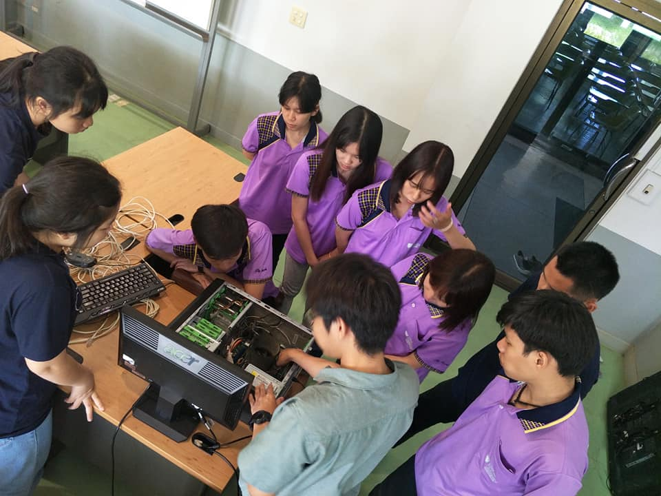

<html>
<meta name="viewport" content="width=device-width, initial-scale=1" />
<body>
    

              
  

</body>
</html>

<h2 id="welcome-to-my-profile">Welcome To My Profile</h2>

ชื่อ-สกุล : นางสาว พัชริดา เจริญผล 

ชื่อเล่น : แพรว

อายุ : 20 ปี

ปัจจุบันศึกษาอยู่ที่มหาวิทยาลัยเนชั่น

คณะบริหารธุรกิจและรัฐประศาสนศาสตร์

สาขาวิทยาการคอมพิวเตอร์ ชั้นปีที่ 3

<h3 id="javaintro"><a href="https://github.com/praew06/midterm_java/blob/master/javaintro.pdf">javaintro</a></h3>

<h3 id="36-pyramid">36 Pyramid</h3>

<a href="https://github.com/praew06/java_pyramid/blob/master/Praew01.java" class="button">pyramid01</a>
<a href="https://github.com/praew06/java_pyramid/blob/master/Praew02.java" class="button">pyramid02</a>
<a href="https://github.com/praew06/java_pyramid/blob/master/Praew03.php" class="button">pyramid03</a>
<a href="https://github.com/praew06/java_pyramid/blob/master/Praew04.php" class="button">pyramid04</a>
<a href="https://github.com/praew06/java_pyramid/blob/master/Praew05.php" class="button">pyramid05</a>

<a href="https://github.com/praew06/java_pyramid/blob/master/Praew06.php" class="button">pyramid06</a>
<a href="https://github.com/praew06/java_pyramid/blob/master/Praew07.php" class="button">pyramid07</a>
<a href="https://github.com/praew06/java_pyramid/blob/master/Praew08.php" class="button">pyramid08</a>
<a href="https://github.com/praew06/java_pyramid/blob/master/Praew09.php" class="button">pyramid09</a>
<a href="https://github.com/praew06/java_pyramid/blob/master/Praew10.php" class="button">pyramid10</a>

<a href="https://github.com/praew06/java_pyramid/blob/master/Praew11.php" class="button">pyramid11</a>
<a href="https://github.com/praew06/java_pyramid/blob/master/Praew12.php" class="button">pyramid12</a>
<a href="https://github.com/praew06/java_pyramid/blob/master/Praew13.php" class="button">pyramid13</a>
<a href="https://github.com/praew06/java_pyramid/blob/master/Praew14.php" class="button">pyramid14</a>
<a href="https://github.com/praew06/java_pyramid/blob/master/Praew15.php" class="button">pyramid15</a>

<a href="https://github.com/praew06/java_pyramid/blob/master/Praew16.php" class="button">pyramid16</a>
<a href="https://github.com/praew06/java_pyramid/blob/master/Praew17.php" class="button">pyramid17</a>
<a href="https://github.com/praew06/java_pyramid/blob/master/Praew18.php" class="button">pyramid18</a>
<a href="https://github.com/praew06/java_pyramid/blob/master/Praew19.php" class="button">pyramid19</a>
<a href="https://github.com/praew06/java_pyramid/blob/master/Praew20.php" class="button">pyramid20</a>

<a href="https://github.com/praew06/java_pyramid/blob/master/Praew21.php" class="button">pyramid21</a>
<a href="https://github.com/praew06/java_pyramid/blob/master/Praew22.php" class="button">pyramid22</a>
<a href="https://github.com/praew06/java_pyramid/blob/master/Praew23.php" class="button">pyramid23</a>
<a href="https://github.com/praew06/java_pyramid/blob/master/Praew24.php" class="button">pyramid24</a>
<a href="https://github.com/praew06/java_pyramid/blob/master/Praew25.php" class="button">pyramid25</a>

<a href="https://github.com/praew06/java_pyramid/blob/master/Praew26.php" class="button">pyramid26</a>
<a href="https://github.com/praew06/java_pyramid/blob/master/Praew27.php" class="button">pyramid27</a>
<a href="https://github.com/praew06/java_pyramid/blob/master/Praew28.php" class="button">pyramid28</a>
<a href="https://github.com/praew06/java_pyramid/blob/master/Praew29.php" class="button">pyramid29</a>
<a href="https://github.com/praew06/java_pyramid/blob/master/Praew30.php" class="button">pyramid30</a>
<a href="https://github.com/suwatjanee005/Java_Pyramid/blob/master/fearn_30.php" class="button">pyramid30</a>

<a href="https://github.com/praew06/java_pyramid/blob/master/Praew31.php" class="button">pyramid31</a>
<a href="https://github.com/praew06/java_pyramid/blob/master/Praew32.php" class="button">pyramid32</a>
<a href="https://github.com/praew06/java_pyramid/blob/master/Praew33.php" class="button">pyramid33</a>
<a href="https://github.com/praew06/java_pyramid/blob/master/Praew34.php" class="button">pyramid34</a>
<a href="https://github.com/praew06/java_pyramid/blob/master/Praew35.php" class="button">pyramid35</a>

<a href="https://github.com/praew06/java_pyramid/blob/master/Praew36.php" class="button">pyramid36</a>

<h3 id="งานมอบหมายที่3">งานมอบหมายที่3</h3>

<a href="https://github.com/praew06/work462/blob/master/70590329_725419167906028_2717535252535836672_n.jpg">คำศัพท์คำสงวน</a> 
 <a href="https://github.com/praew06/work462/blob/master/work3.B.pdf">Argument</a>

<h3 id="งานมอบหมายที่4">งานมอบหมายที่4</h3>

<a href="https://github.com/praew06/4_java/blob/master/1-10.pdf">คำผิด10โปรแกรมพร้อมเฉลย</a>

<h3 id="งานมอบหมายที่5">งานมอบหมายที่5</h3>

<a href="https://github.com/praew06/5java/blob/master/work5java.pdf">โปรแกรมรับค่าจากแป้นพิมพ์เก็บลงอาร์เรย์</a>

<h3 id="midtrem-project"><a href="https://github.com/praew06/midterm_java/blob/master/Midterm_Java.pdf">Midtrem Project</a></h3>

     

